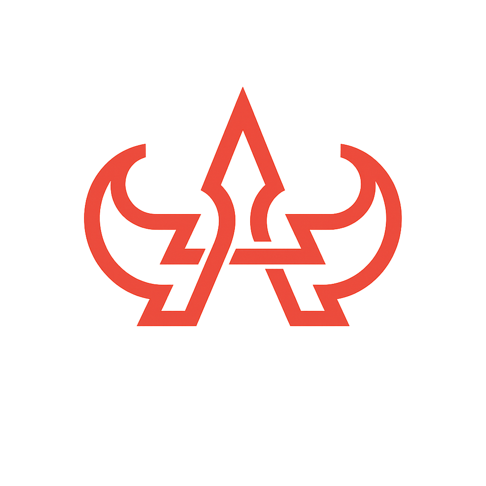

  
  <h1>0IPRX : CORE ARCHITECT</h1>
  
<b>Advanced Systems Engineering & Forensic Cyber-Security Infrastructure</b>

  
  

    
    
    
  

---

## 🌌 TECHNICAL MANIFESTO
I engineer high-integrity digital ecosystems designed for massive scale and absolute security. My methodology focuses on **Hardening the modern web** through advanced forensic analysis, anti-exploit architecture, and low-latency system integration.

 

  <table>
    <tr>
      <td align="center"><b>CYBER DEFENSE</b>  Advanced XSS/SQLi Mitigation</td>
      <td align="center"><b>CORE SYSTEMS</b>  Scalable Microservices</td>
      <td align="center"><b>ELITE UI/UX</b>  Reactive Glassmorphism</td>
    </tr>
  </table>

---

## 🛠️ THE TECHNOLOGICAL ARSENAL

### 💻 Languages & Logical Core

  
  
  
  
  
  
  

### ⚛️ Frontend & Interface Architecture

  
  
  
  
  
  
  

### ⚙️ Backend & Persistence Systems

  
  
  
  
  
  
  
  

### 🛡️ Dev-Ops & Workflow

  
  
  
  
  
  
  
  

---

## 🚀 MISSION-CRITICAL DEPLOYMENTS

### 🌐 [Muvxn Platform](https://muvxn.live)
*Lead Architect & Security Engineer*
- **Stack:**   
- **Core:** High-concurrency social content and streaming platform with AI-driven analytics.

### ⚡ [HiddenRP Infrastructure](https://hiddenrp.site)
*System Integration & Database Architect*
- **Stack:**   
- **Core:** Automated Discord-to-FiveM Whitelist bridge with real-time encrypted data synchronization.

### 🤖 [RP System Bots]
*Lead Automation Developer*
- **Stack:**   
- **Core:** Advanced Roleplay server management systems featuring multi-server ban synchronization and security auditing.

### ⚡ [Zerix.site Official Store](https://zerix.site)
*Full-Stack Developer & Integration Specialist*
- **Stack:**   
- **Core:** High-performance official store showcase and automated service delivery gateway.

---

## 📊 ANALYTICAL OVERVIEW

  
  
   
  

 

  
  

    <b>SYSTEM STATUS: </b> 
    <i>"The future of the web is built on resilient architecture."</i>
  

