

  <!-- Main Logo -->
  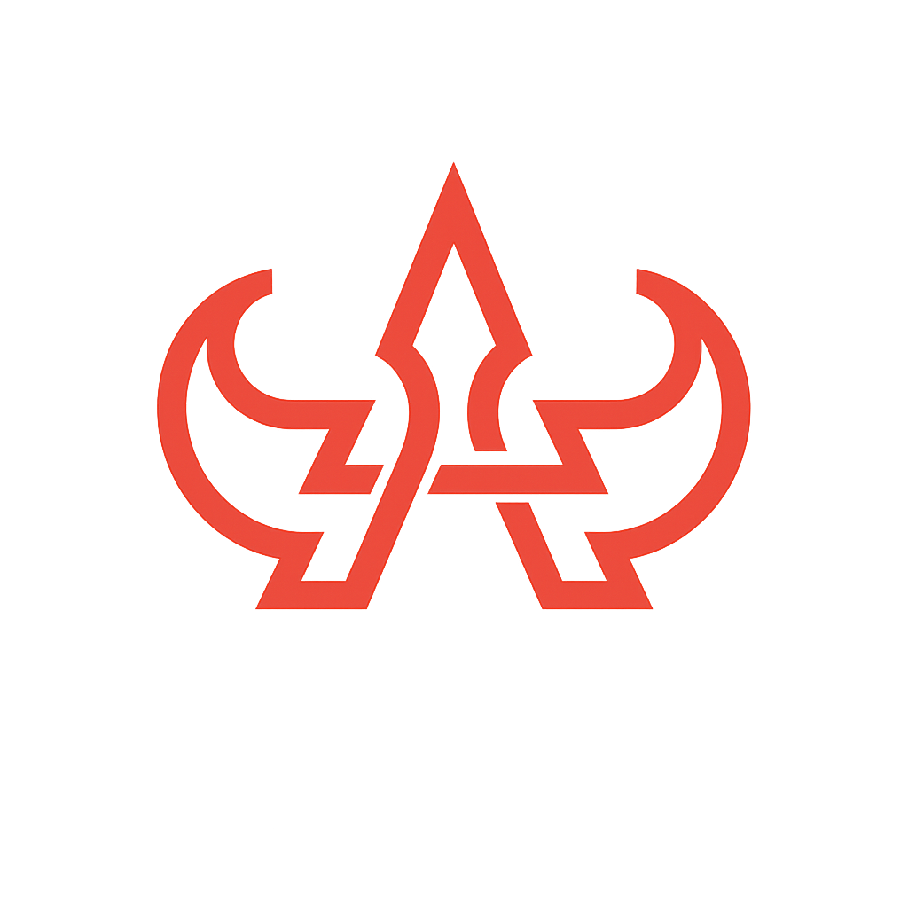
  
  <h1>0IPRX : CORE ARCHITECT</h1>
  
  

    <b>Advanced Systems Engineering • Real-Time Web Platforms • Forensic Cyber Defense</b>
  

  

    
    
    
    
  

  <!-- Quick Navigation -->
  

    <a href="#flagship-platforms--products"><code>[ Featured Projects ]</code></a> •
    <a href="#streamer-portals--creator-networks"><code>[ Streamer Hubs ]</code></a> •
    <a href="#gaming-infrastructure--fivem-systems"><code>[ Game Systems ]</code></a> •
    <a href="#enterprise-discord-automation"><code>[ Discord Bots ]</code></a> •
    <a href="#the-technological-arsenal"><code>[ Tech Stack ]</code></a> •
    <a href="#telemetry--system-metrics"><code>[ Telemetry ]</code></a> •
    <a href="#contact--communication"><code>[ Contact ]</code></a>
  

---

## Core Methodology
> *"Engineering high-integrity digital ecosystems, low-latency real-time applications, and resilient cloud architectures with precision and security hardening."*

Specialized in building scalable full-stack web platforms, real-time multiplayer engines, creator telemetry hubs, secure RBAC infrastructures, and enterprise Discord ecosystems.

---

## Flagship Platforms & Products

<table>
  <!-- HARFAK SAH -->
  <tr>
    <td width="22%" align="center" valign="middle">
      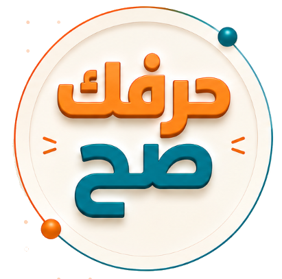  
      
    </td>
    <td width="78%" valign="top">
      <h3><a href="https://harfaksah.com">حرفك صح | HarfakSah.com</a></h3>
      

        <b>منصة ألعاب جماعية تفاعلية فورية فائقة السرعة على الويب:</b> 
        إعادة إحياء وتطوير عصري وتنافسي لألعاب الزمن الجميل (حيوان، نبات، جماد، بلاد، والمزيد) بأحدث تقنيات الويب السحابية. تتميز بزمن استجابة فائق اللحظية (Sub-second Latency)، ونظام تصحيح تنافسي ذكي بين اللاعبين ومراجعة جماعية للنتائج ومشاركة الغرف مع الأصدقاء بكل سلاسة وبدون قيود.
      

      

        
        
        
        
        
      

    </td>
  </tr>

  <!-- MUVXN -->
  <tr>
    <td width="22%" align="center" valign="middle">
      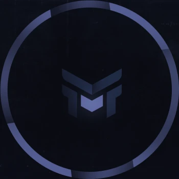  
      
    </td>
    <td width="78%" valign="top">
      <h3><a href="https://muvxn.live">Muvxn Hub & Telemetry</a></h3>
      

        <b>بوابة رقمية متقدمة لصناع المحتوى والستريمرز مع لوحة تحكم ذكية:</b> 
        منصة تجمع بين الربط اللحظي لمنصة Kick وسيرفرات Discord لجلب وتحليل بيانات البث الحي (المشاهدات، المتابعين، الكليبات والميمز). تتضمن لوحة تحكم إدارية (Admin Dashboard) متكاملة لإدارة التذاكر وطلبات التقديم مع فلترة ذكية وحماية ضد ثغرات الحقن.
      

      

        
        
        
        
        
      

    </td>
  </tr>

  <!-- ZERIX -->
  <tr>
    <td width="22%" align="center" valign="middle">
      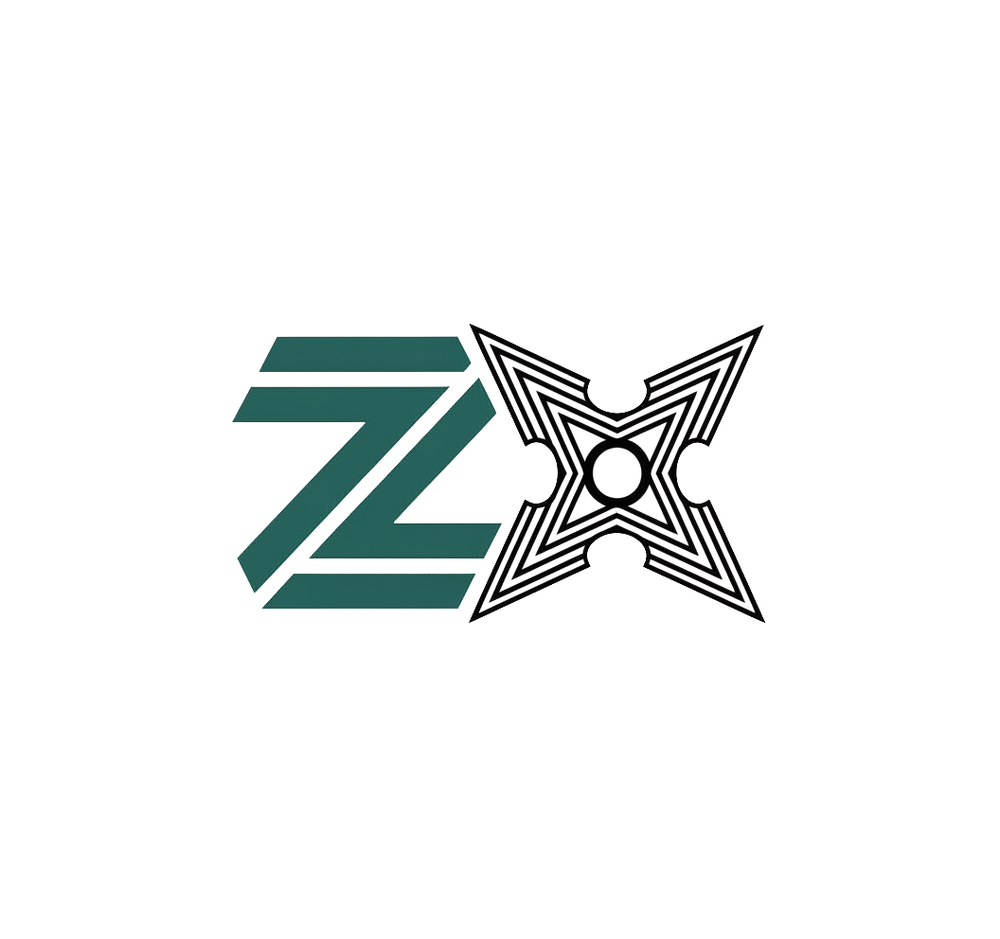  
      
    </td>
    <td width="78%" valign="top">
      <h3><a href="https://zerix.site">Zerix Solutions & Store</a></h3>
      

        <b>المتجر والمنصة الرقمية لعرض وطلب الخدمات البرمجية والحلول المؤتمتة:</b> 
        منصة تجارة إلكترونية وبوابة متخصصة لعرض الحلول والأنظمة البرمجية، البوتات المخصصة، وحلول السيرفرات مع منظومة مؤتمتة لمعالجة وإدارة طلبات العملاء، ونظام أذونات متطور (Full RBAC) لحماية العمليات الإدارية.
      

      

        
        
        
        
      

    </td>
  </tr>

  <!-- STOCK DASHBOARD -->
  <tr>
    <td width="22%" align="center" valign="middle">
        
      
    </td>
    <td width="78%" valign="top">
      <h3><a href="https://github.com/0iprx/Real-Time-Stock-Analysis-Dashboard">Real-Time Stock Analysis Dashboard</a></h3>
      

        <b>لوحة تحليلات مالية ورسوم بيانية للأسهم لحظة بلحظة:</b> 
        تطبيق ويب عالي الأداء لمعالجة وتصور بيانات الأسهم اللحظية، ومراقبة تقلبات السوق ورسم المؤشرات البيانية التفاعلية باستخدام TypeScript لضمان أعلى معايير الـ Type Safety وسرعة الاستجابة.
      

      

        
        
        
        
      

    </td>
  </tr>
</table>

---

## Streamer Portals & Creator Networks
بوابات رقمية مخصصة ومصممة بدقة لصناع المحتوى لعرض حالة البث المباشر، الشات التفاعلي، سجل الداعمين، وتكامل Botrix:

  <table>
    <tr>
      <td align="center" width="33%">
        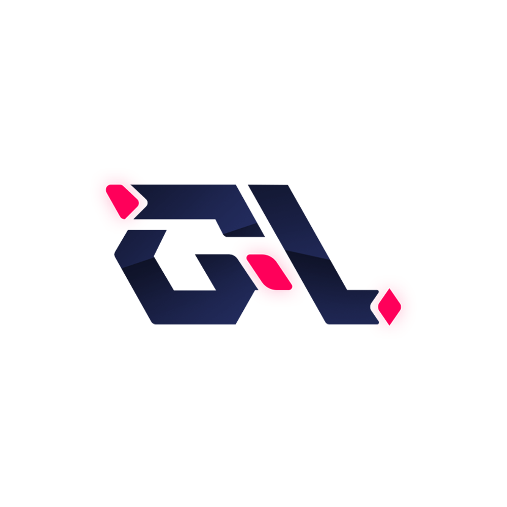 
        <b>gene4al</b> 
        
      </td>
      <td align="center" width="33%">
         
        <b>ioyazeed</b> 
        
      </td>
      <td align="center" width="33%">
        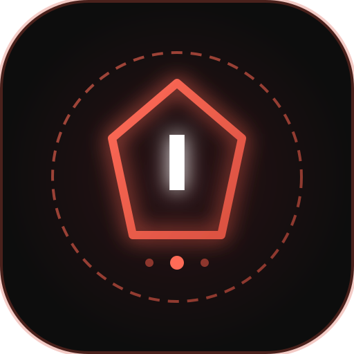 
        <b>idiori</b> 
        
      </td>
    </tr>
    <tr>
      <td align="center" width="33%">
        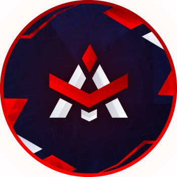 
        <b>labdullahh</b> 
        
      </td>
      <td align="center" width="33%">
        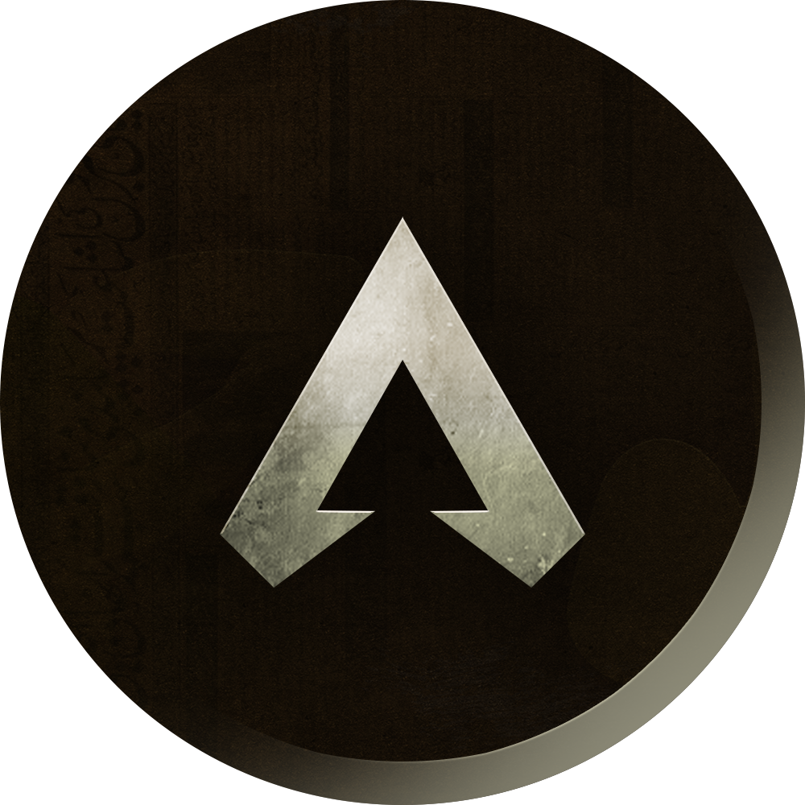 
        <b>abuhamad0</b> 
        
      </td>
      <td align="center" width="33%">
         
        <b>muvxn</b> 
        
      </td>
    </tr>
  </table>

---

## Gaming Infrastructure & FiveM Systems

<table>
  <tr>
    <td width="18%" align="center">
      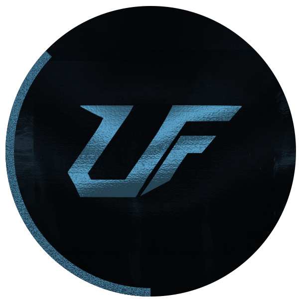 
      
    </td>
    <td width="82%">
      <b>Ultimate Fight | CFX Live Telemetry</b> 
      موقع تعريفي وبوت متطور مربوط مباشرة عبر CFX API لجلب عدد اللاعبين المتصلين لحظياً، وحالة السيرفر وإحصائياته العامة. 
      <code>CFX API</code> <code>React.js</code> <code>Discord.js</code> <code>Live Telemetry</code>
    </td>
  </tr>
  <tr>
    <td width="18%" align="center">
      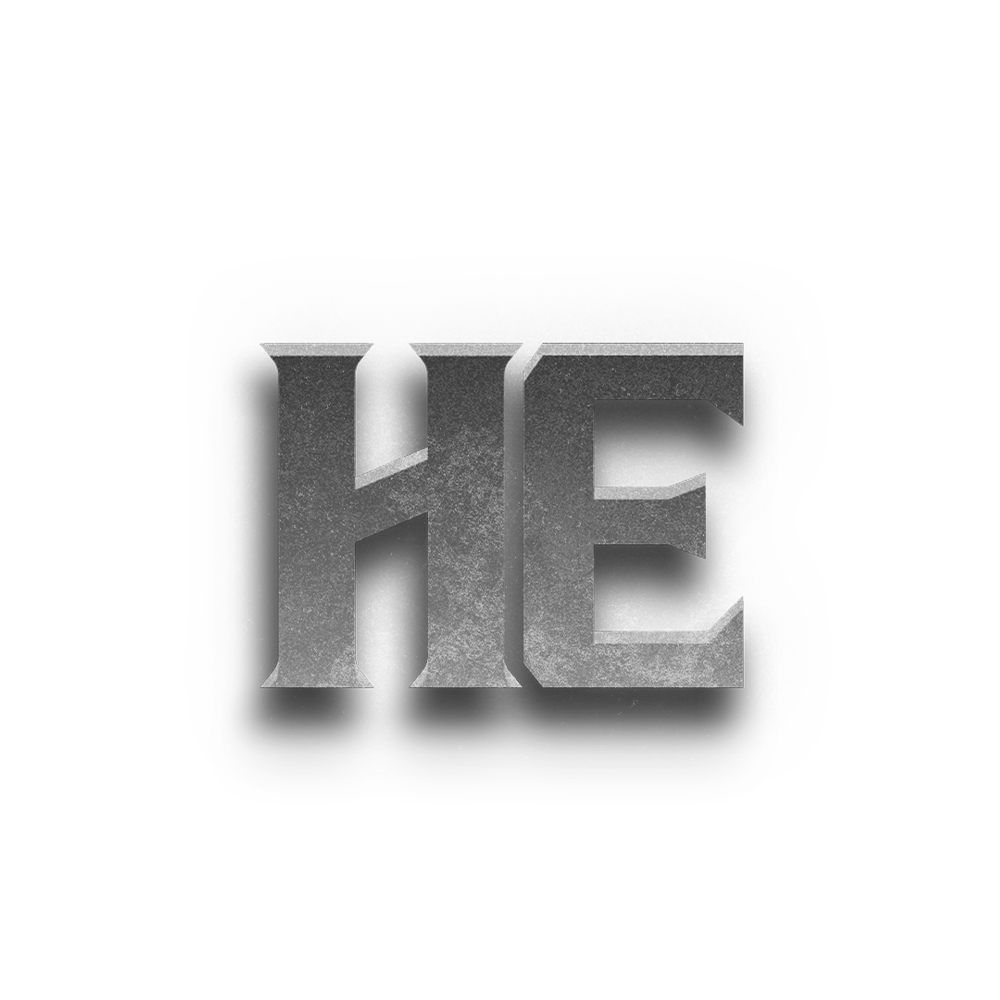 
      
    </td>
    <td width="82%">
      <b>HiddenRP & Hidden Empire | Auto-Whitelist Bridge</b> 
      نظام ربط متكامل بين ديسكورد وسيرفرات FiveM مع نظام Whitelist تلقائي يمنح الرتب والصلاحيات اللحظية، وتشفير بيانات اللاعبين بقواعد MySQL المتزامنة. 
      <code>FiveM API</code> <code>MySQL AES-256</code> <code>Express Backend</code> <code>Auto-Whitelist</code>
    </td>
  </tr>
  <tr>
    <td width="18%" align="center">
      
    </td>
    <td width="82%">
      <b>Revenge Town & 6a6RP Systems</b> 
      منظومة أتمتة إدارية شاملة: رصد نقاط الإدارة، مراقبة وتقييم المشرفين، تذاكر الدعم الفني، الترحيب التلقائي، والتوثيق الأمني للعمليات. 
      <code>Discord.js</code> <code>Staff RBAC Analytics</code> <code>MySQL Cluster</code> <code>Audit Pipelines</code>
    </td>
  </tr>
</table>

---

## Enterprise Discord Automation

<table>
  <tr>
    <td width="28%"><b>Clinic & Consultation Bot</b></td>
    <td>بوت ديسكورد مبتكر ومؤتمت لإدارة وتنسيق الجلسات الاستشارية والمواعيد مع تشفير تام وخصوصية مطلقة لسجلات الأعضاء.</td>
  </tr>
  <tr>
    <td width="28%"><b>Smart Support Ticket Engine</b></td>
    <td>بوت ديسكورد احترافي لإدارة تذاكر الدعم والشكاوى، توزيع الطلبات على المشرفين، وتصدير كامل لسجلات المحادثة HTML Transcripts.</td>
  </tr>
  <tr>
    <td width="28%"><b>Security & Audit Logging Bot</b></td>
    <td>رصد لحظي وتوثيق أمني لجميع أحداث السيرفر (تعديل الرتب، حذف الرسائل، الصلاحيات، وحركات الأعضاء).</td>
  </tr>
  <tr>
    <td width="28%"><b>Interactive Suggestions Bot</b></td>
    <td>استقبال مقترحات المجتمع مع نظام تصويت تفاعلي لحظي بالأزرار وتتبع آلي لدورة حياة الاقتراح.</td>
  </tr>
</table>

---

## The Technological Arsenal

  <table>
    <tr>
      <td align="right" width="22%"><b>Languages & Core</b></td>
      <td>
        
        
        
        
        
        
      </td>
    </tr>
    <tr>
      <td align="right"><b>Frontend & UI</b></td>
      <td>
        
        
        
        
      </td>
    </tr>
    <tr>
      <td align="right"><b>Data & Real-Time</b></td>
      <td>
        
        
        
        
      </td>
    </tr>
    <tr>
      <td align="right"><b>DevOps & Cloud</b></td>
      <td>
        
        
        
        
      </td>
    </tr>
    <tr>
      <td align="right"><b>Security & Auth</b></td>
      <td>
        
        
        
        
      </td>
    </tr>
  </table>

---

## Telemetry & System Metrics

  

    
    
    
  

  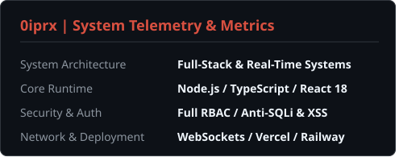

---

## Contact & Communication

  
<b>هل لديك فكرة مشروع، استفسار تقني، أو ترغب ببناء نظام ويب أو بوت مخصص؟ تواصل معي مباشرة:</b>

  

    
    
    
  

  

    <b>Designed & Engineered by <a href="https://0iprx.com">0iprx (Abdullah)</a></b> 
    <i>"Software systems built with passion and precision."</i>
  

